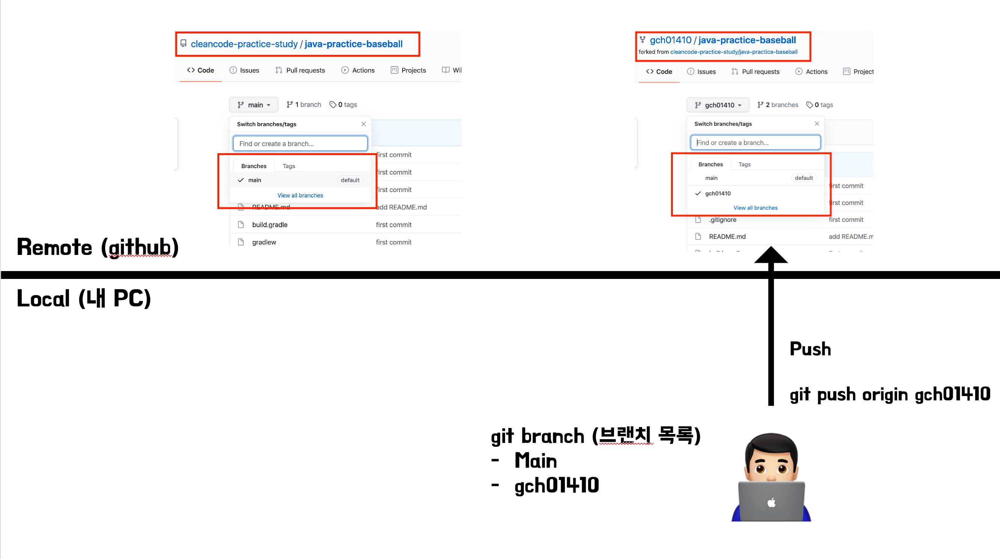

## 미션 제출

---
1. 프로젝트를 자신의 계정으로 fork한다. 저장소 우측 상단의 fork 버튼을 클릭해 fork한다.
> cleancode-practice-study 저장소에 코드를 추가할 권한이 없기 때문에 구현한 코드를 추가할 수 없다.
> 
> fork는 cleancode-practice-study의 저장소를 자신의 계정으로 복사하는 기능이다. 앞으로 모든 미션은 자신의 계정 아래에 있는 저장소를 활용해 진행한다.

다음 그림과 같이 cleancode-practice-struy 저장소 우측 상단의 fork 버튼을 클릭해 fork한다.


fork를 완료한 후의 저장소 상태는 다음과 같다.


---
2. fork한 저장소를 자신의 컴퓨터로 clone한 후 폴더로 이동한다.
> fork한 저장소는 github.com에 존재하기 때문에 소스 코드를 추가하고, 수정하는 작업을 할 수 없다.
>
> clone 명령은 github.com에 존재하는 저장소를 자신의 노트북 또는 PC로 복사하는 과정이다.

터미널에서 다음 명령을 입력한다.

```
git clone https://github.com/{본인_아이디}/{저장소 아이디}.git
ex) git clone https://github.com/gch01410/java-practice-baseball.git
```

```
// clone한 폴더로 이동하는 방법
cd {저장소 아이디}
ex) cd java-practice-baseball
```

clone을 완료한 후의 저장소 상태는 다음과 같다.


---
3. 기능 구현을 위한 브랜치 생성
> git은 서로 다른 작업을 하기 위한 별도의 공간을 생성할 때 브랜치를 생성할 수 있다.

터미널에서 다음 명령을 입력해 브랜치를 생성한다.

```
git checkout -b 브랜치이름
ex) git checkout -b gch01410
```

브랜치를 생성한 후의 상태는 다음과 같다.


---
4. 저장소의 별칭을 지정한다.

```
git remote add 저장소별칭 저장소주소
ex) git remote add origin https://github.com/gch01410/java-practice-baseball
```

---
4. 통합개발도구(Eclipse 또는 IntelliJ)로 가져오기(import)
> 미션 진행을 위해 자신이 사용하고 있는 통합개발도구로 가져오기 한다. 이 문서는 IntelliJ를 기준으로 한다.

* IntelliJ를 시작
* 다음 화면에서 Import Project


* 앞에서 clone한 폴더를 선택한다.
* 다음 화면과 같이 "Import Project from external model" 선택 -> Gradle을 선택 -> Next


* 다음 화면에서 Finish 버튼을 클릭해 가져오기를 완료한다.


---
5. 기능 구현
> 미션 요구사항을 파악해 기능을 구현한다.

---
6. 기능 구현 후 add, commit
> 기능 구현을 완료한 후 로컬 저장소에 변경된 부분을 반영하기 위해 add, commit 명령을 사용한다.

```
git status // 변경된 파일 확인
git add -A(또는 .) // 변경된 전체 파일을 한번에 반영
git commit -m "메시지" // 작업한 내용을 메시지에 기록
```

기능 구현을 완료하고 add, commit 명령을 실행한 후의 상태는 다음과 같다.


---
7. 본인 원격 저장소에 올리기
> 로컬에서 commit 명령을 실행하면 로컬 저장소에만 반영되고, 원격 github.com의 저장소에는 반영되지 않는다.

```
git push 저장소별칭 브랜치이름
ex) git push origin gch01410
```

push 명령을 실행한 후의 상태는 다음과 같다.


---
8. github 서비스에서 pull request를 보낸다.
> pull request는 github에서 제공하는 기능으로 코드리뷰 요청을 보낼 때 사용한다.
> 
> pull request는 original 저장소(cleancode-practice-study의 저장소)의 gch01410 브랜치와 앞 단계에서 생성한 브랜치 이름(앞 단계의 예에서는 gch01410)을 기준으로 한다.

```
ex) 미션을 진행한 gch01410/java-practice-baseball gch01410 브랜치 => cleancode-practice-study/java-practice-baseball gch01410 브랜치로 pull request를 보낸다.
```

* 브라우저에서 github 저장소에 접근한다.
* "pull request" 탭을 클릭한다.
* "New pull request" 버튼을 클릭한다.


* 요청 보내는 위치로 개인 저장소(gch01410 계정의 java-practice-baseball 저장소)에 저장된 작업내용(gch01410 브랜치)를 선택한다.
* 요청 받는 위치로 공통 저장소(cleancode-practice-study 그룹의 java-practice-baseball 저장소)의 개인계정이 이름으로 되어있는 브랜치(예제의 경우, gch01410)를 선택한다.
* 현재 미션에서 작업한 내용을 입력하고 "Create pull request" 버튼을 클릭해 pull request를 보낸다.


pull request를 보냈을 때의 상태는 다음과 같다.


---

Pull Request를 보낸 후, pr보냈다고 카톡방에 공유한다.